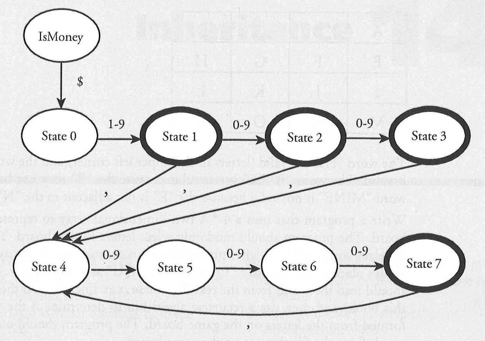

# CPTR 142: Homework Assignment #14

## Deterministic Finite State Automaton (DFA)

The accompanying diagram is an example of a *deterministic finite state automaton* or DFA.
This particular DFA describes an algorithm to determine if a sequence of characters is properly formatted monetary amount with commas.
For example, "$1,000" and "$25" and "$551,323,991,391" are properly formatted but "1,000" (no initial $) and "$1000" (missing comma) and "$5424,132" (missing comma) are not.

The DFA works by starting in the oval labeled IsMoney.
This is the initial state. If the first character of the string is $, then we advance to the second character and move to state 0.
Otherwise we conclude the string is not a proper monetary amount.
In state 0, if the second character is a digit between 1 and 9, then we advance to the third character and move to state 1.
Otherwise we conclude the string is not a proper monetary amount.
In state 1, if we have no more characters left in the string then we conclude that the string is a monetary amount.
This is called a *final state* and is indicated by a bold oval.
If the third character is a digit between 0 and 9, then we advance to the fourth character and move to state 2.
Otherwise if the third character is a comma then we advance to the fourth character and move to state 4.
Otherwise we conclude the string is not a proper monetary amount.
The rest of the DFA behaves in a similar manner.



## Solution Specifications

### Recursion

Write a program that uses recursion to implement the DFA.
Your program should have a separate function for each state in the DFA.
Each function should invoke the function corresponding to the next state indicated by the arrows in the diagram.
There is mutual recursion because of the loop from state 7 to state 4.

### Exception Handling

Instead of a function, isMoney(), that returns a boolean, define a void function for the following function prototype:

```c++
// throws a runtime_error if the input string is not properly formatted
void verifyIsMoney(string inputString);
```

### Submitty

Your submission should only make changes to `money.cpp`.
You should not need to modify `money.h` and you should write tests in `main.cpp` (though your file will be replaced with one used by Submitty for testing).

### Push to GitLab

When you are satisfied that your code works, use the `push.sh` script to save it to GitLab.
To verify that step you can open [GitLab](https://gitlab.cs.wallawalla.edu/) in a web browser to verify that the code transferred from Code.CS.
While you should write a test program to verify your code, your submitted code should not include `main()`.

## Grade Specification

Your homework assignment assigned a grade of E (exceeds expectation),
M (meets expectation), R (revise and resubmit) or N (not assessable) as follows:

* E -- passes all Submitty tests with a score of 100% (green bars, no
compiler warnings)
* M -- passes all Submitty tests, but has a score of less than 100% on
some (yellow or green bars)
* R -- fails at least one Submitty test (red bars)
* N -- no substantive changes made to template, or nothing submitted
